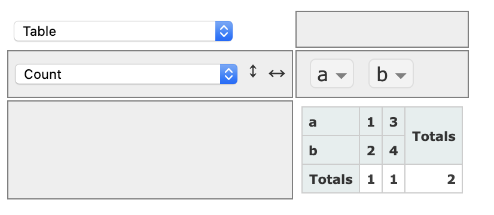

=====
Usage
=====

To use sho in a project::

    import sho
    import pandas as pd
    df = pd.DataFrame([{"a":1, "b": "c"}, {"a":2, "b": "d"}] )
    sho.w(df)

And all things working a browser should open with something resembling:

Its as simple as that !